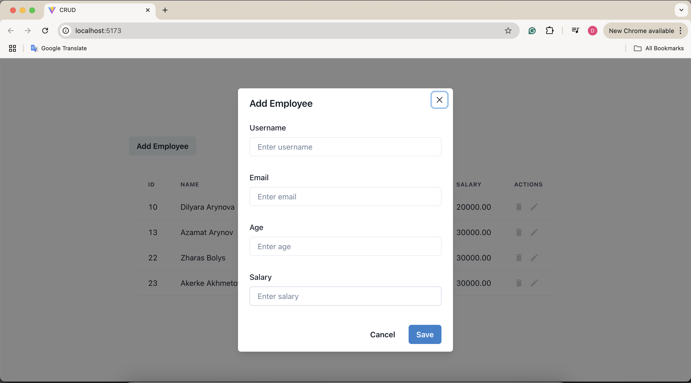
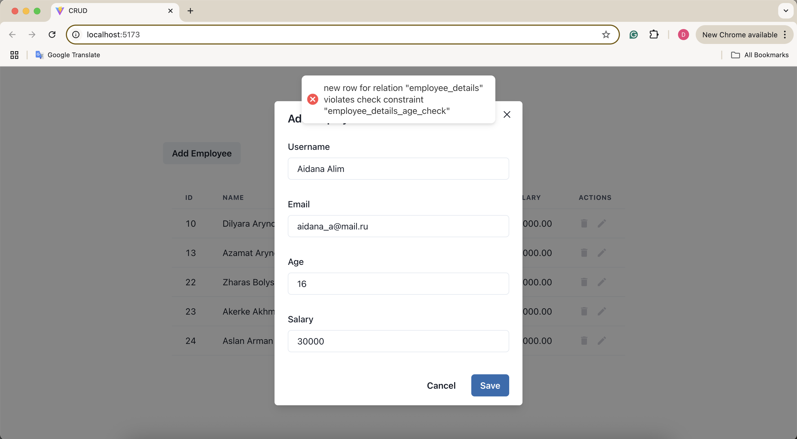
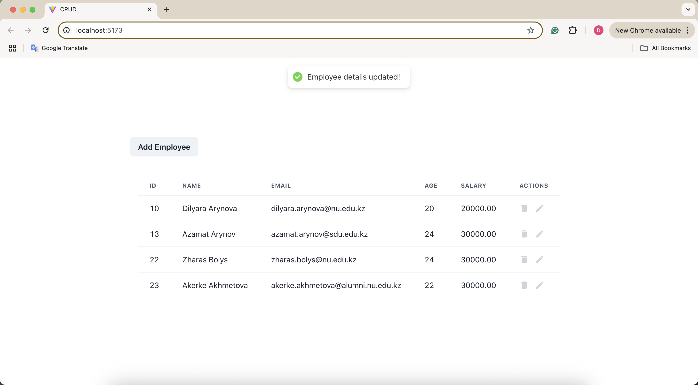
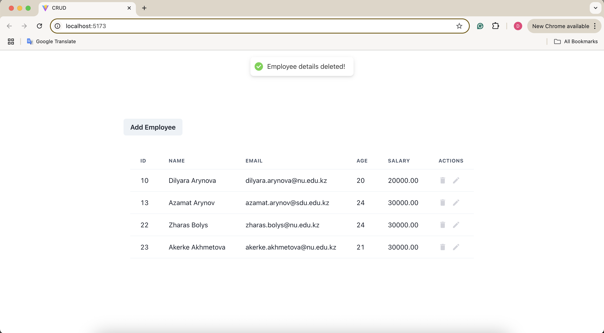

# employee-admin-CRUD
This is a simple full-stack CRUD application for managing information about employees (name, email, age, salary) using PostgreSQL, Express.js, React.js and Node.js. Application is not deployed yet, but can be run locally.

## Features
Add, edit, and delete employee records. 

<p align="center">
  
  
  
  
</p>
If the user enters an age less than 18, the app shows an error (as defined by the PostgreSQL constraint: CHECK (age > 17)).

## Tech Stack
- Frontend: React, Chakra UI, React Query
- Backend: Node.js, Express
- Database: PostgreSQL

## To run locally:

1. Clone the repository:
```bash
   git clone https://github.com/dilyaraarynova/employee-admin-CRUD.git
   cd employee-admin-CRUD
```
2. Install dependencies:
```bash
   cd backend && npm install
   cd frontend && npm install
```
3. Start both servers:
```bash
   cd backend && npm run dev
   cd frontend && npm run dev
```
6. Visit: `http://localhost:5173/`

Make sure PostgreSQL is running and accessible.

## Author

Made by Dilyara Arynova
